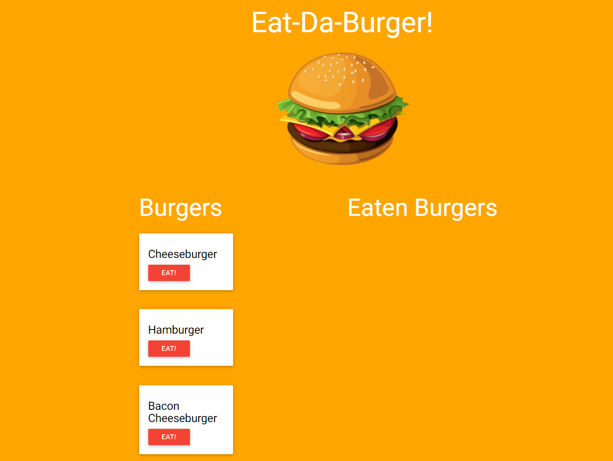

# EatThe Burger

https://burgerify.herokuapp.com/

#### Description
An app using the mvc format with handlebars as its rendering engine and a MySQL server to store information.

#### Usage
Type in the search bar to add a burger to the screen and click the buttons to eat and un eat the burgers.

##### Questions

For any comments or questions please contact me at: mcraig150@gmail.com

